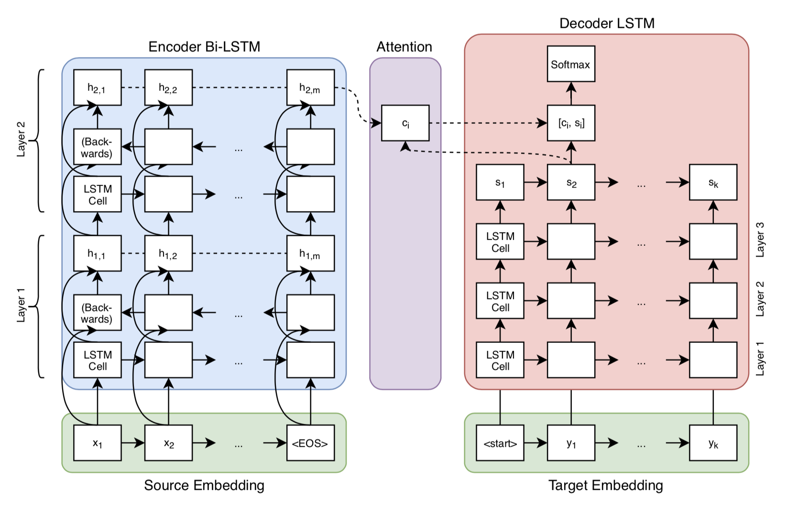
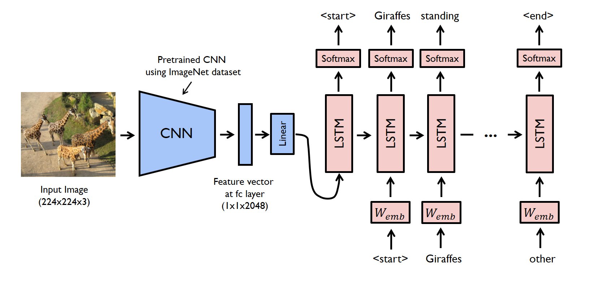

 Data Scientist

#### Technical Skills:  Python (numpy, pandas, scikit-learn, mlflow), Deep Learning Frameworks (PyTorch, TensorFlow), C/C++ , AWS, SQL , SnowFlake, Docker, Git, CI/CD(GitHub Actions),Shell programming.

## Education
- Master in Data Science | University of Colorado Boulder  
- BE in Computer Science | Rajalakshmi Engineering College 

## Work Experience
**Machine Learning Engineer / Data Scientist @ WeDigiStudio**
- Developed a Drowsiness detection model using the YOLOv8 model for Brakes India Private Limited Company
- Developed a two difference size model one with 25 epochs and 125 epochs and converted into TFLite format.

**Computer Vision Intern  @ TU Dortmund University**
- Conducted data preprocessing and augmentation on diverse datasets
- Working on the data annotation process and writing comprehensive technical documentation 

## Projects
### Neural Machine Translation for Tamil
[GitHub Link](github.com/NickStrain/Machine-Translation.git)

Developed a model aiming to achieve a BLEU score of 41, surpassing current benchmarks for Tamil language translation models.\n
Optimized the model to achieve high performance with minimal processing power, reducing computational requirements by 20% compared to baseline models.\n
Processed and binarized the Bharath Parallel Corpus Collection (BPCC), containing 8GB of sentence pairs for Tamil language, for training.\n

### Image Captioning: 
[GitHub Link](https://github.com/NickStrain/Image-Captioning.git)

Built a model that annotates images with relevant captions, achieving a BLEU score of 0.5, indicating high relevance and accuracy.
Utilized a Convolutional Neural Network (CNN) to extract visual features such as color, shape, and texture from images.
Reduced training time by 30% through efficient preprocessing and model optimization techniques.

### Satellite Image Segmentation: 
[GitHub Link](https://github.com/NickStrain/Image-Captioning.git)

Designed a model to segment satellite images into classes like land, water, and roads, achieving a mean Intersection over Union (mIoU) score of 78%.
Combined U-Net with ViT (Vision Transformer) to enhance accuracy while requiring only 1,500~ labeled images, demonstrating effectiveness with low data.
Achieved a loss function value of 0.68, outperforming standard models on similar datasets by 15%.

## WorkShop & Lectures
- Causality: The new science of an old question - GSP Seminar, Fall 2021
- Guest Lecture: Dimensionality Reduction - Big Data and Machine Learning for Scientific Discovery (PHYS 5336), Spring 2021
- Guest Lecture: Fourier and Wavelet Transforms - Scientific Computing (PHYS 5315), Fall 2020
- A Brief Introduction to Optimization - GSP Seminar, Fall 2019
- Weeks of Welcome Poster Competition - UTD, Fall 2019
- A Brief Introduction to Networks - GSP Seminar, Spring 2019

- [Data Science YouTube](https://www.youtube.com/channel/UCa9gErQ9AE5jT2DZLjXBIdA)

## Publications
1. S Suresh Kumar, D Gayathri, R Shugavaneshwar, "Enhancing Deep Learning Models for Sentiment Analysis Integrating Texts and Emojis: A Comprehensive Survey," IEEE, 2024.[Link](https://ieeexplore.ieee.org/document/10544333) 

- [Machine Learning blog]()
