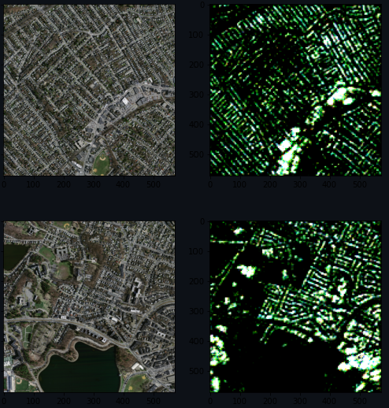

#### Technical Skills:     
Languages & Tools:  Python, C/C++, R, SQL, Git, Shell, MATLAB, CI/CD (GitHub Actions).  
Data & Deployment: AWS (EC2, S3, Lambda), Docker, Kubernetes, MLflow, TFLite, REST APIs, Streamlit, Tableau, Power BI, ETL, CI/CD  
Databases:  PostgreSQL, MySQL, MongoDB, Snowflake, Redis  
Key Strengths: Real-time AI Systems, Data Science Pipelines, Model Optimization, Explainable AI (XAI), MLOps, Cloud-Native Deployments.  
ML/AI: Predictive Modeling, Statistical Analysis, Deep Learning (PyTorch, TensorFlow), Computer Vision, NLP, Transformers, Generative Models, Large Language Models (LLMs), Data Mining, Reinforcement Learning, Optimizers, Feature Engineering   

## Education
- Master in Data Science | University of Colorado Boulder  
- BE in Computer Science | Rajalakshmi Engineering College 

## Work Experience
**Machine Learning Engineer / Data Scientist @ WeDigiStudio**
- Built a real-time driver drowsiness detection system for Brakes India Pvt Ltd, improving safety for 500+ test drivers.
- Converted YOLOv8-based models to TFLite,  facilitating low-cost deployment and cutting inference latency by ~40%.
- Collaborated with stakeholders to shape KPIs, driving both accuracy and client value.
- Improved model accuracy by 15% by data augmentation and hyperparameter tuning, ensuring reliable deployment.

**Computer Vision Intern  @ TU Dortmund University**
- Conducted data preprocessing and augmentation on diverse datasets
- Working on the data annotation process and writing comprehensive technical documentation 

## Projects
### CleanMeet AI
[GitHub Link](https://github.com/NickStrain/CleanMeetAI)

Real-time multi-modal AI system detecting vulgarity and NSFW content to ensure safe, professional virtual meetings. 
Achieved 92% detection accuracy with <120ms latency, protecting users without disrupting call quality.  
Built a multi-modal model combining visual, text, and audio cues, achieving 92% accuracy in detecting vulgarity and harmful behavior, improving meeting safety and compliance by 30%. 
Integrated with OBS Studio virtual camera, enabling deployment to 3+ major platforms (Zoom, Teams, Meet) and scaling to handle 100+ concurrent meetings seamlessly.  

### Neural Machine Translation for Tamil
[GitHub Link](https://github.com/NickStrain/Machine-Translation)

Developed a model aiming to achieve a BLEU score of 41, surpassing current benchmarks for Tamil language translation models. 
Optimized the model to achieve high performance with minimal processing power, reducing computational requirements by 20% compared to baseline models. 
Processed and binarized the Bharath Parallel Corpus Collection (BPCC), containing 8GB of sentence pairs for Tamil language, for training. 

### Image Captioning: 
[GitHub Link](https://github.com/NickStrain/Image-Captioning.git)

Built a model that annotates images with relevant captions, achieving a BLEU score of 0.5, indicating high relevance and accuracy. 
Utilized a Convolutional Neural Network (CNN) to extract visual features such as color, shape, and texture from images. 
Reduced training time by 30% through efficient preprocessing and model optimization techniques. 

### Satellite Image Segmentation: 
[GitHub Link](https://github.com/NickStrain/Image-Captioning.git)

Designed a model to segment satellite images into classes like land, water, and roads, achieving a mean Intersection over Union (mIoU) score of 78%. 
Combined U-Net with ViT (Vision Transformer) to enhance accuracy while requiring only 1,500~ labeled images, demonstrating effectiveness with low data. 
Achieved a loss function value of 0.68, outperforming standard models on similar datasets by 15%. 

## WorkShop & Lectures
- Causality: The new science of an old question - GSP Seminar, Fall 2021
- Guest Lecture: Dimensionality Reduction - Big Data and Machine Learning for Scientific Discovery (PHYS 5336), Spring 2021
- Guest Lecture: Fourier and Wavelet Transforms - Scientific Computing (PHYS 5315), Fall 2020
- A Brief Introduction to Optimization - GSP Seminar, Fall 2019
- Weeks of Welcome Poster Competition - UTD, Fall 2019
- A Brief Introduction to Networks - GSP Seminar, Spring 2019

- [Data Science YouTube](https://www.youtube.com/channel/UCa9gErQ9AE5jT2DZLjXBIdA)

## Publications
1. S Suresh Kumar, D Gayathri, R Shugavaneshwar, "Enhancing Deep Learning Models for Sentiment Analysis Integrating Texts and Emojis: A Comprehensive Survey," IEEE, 2024.[Link](https://ieeexplore.ieee.org/document/10544333) 

- [Machine Learning blog]()
